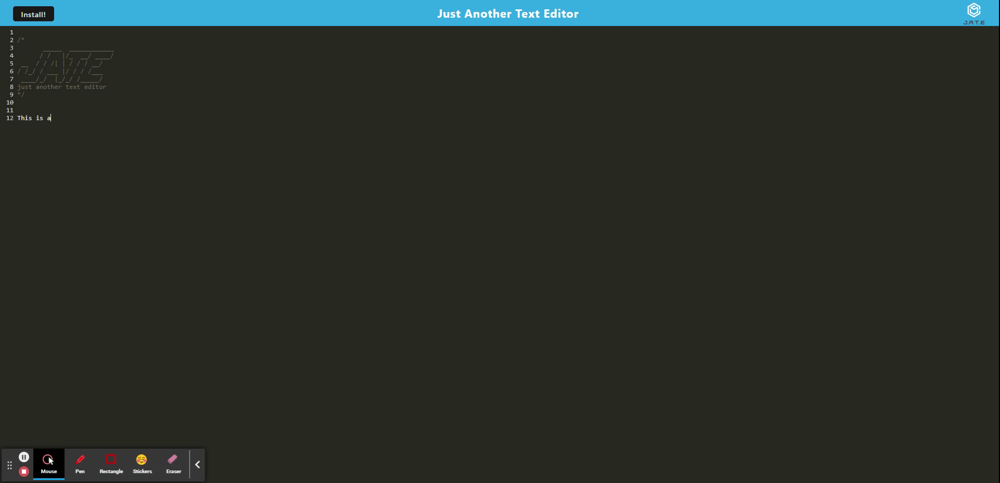

# Accretion
[](https://opensource.org/licenses/MPL-2.0)

## Table of Contents
[Description](#description)

[Installation](#installation)

[Usage](#usage)

[Screenshots](#screenshots)

[Credits](#credits)

[Dependencies and Libraries](#dependencies/libraries)

[Questions](#questions)

[Future Development](#future-development)

---
<br>


## Description
This is Just Another Text Editor that can be run in browser or installed locally as a progressive web app

---  
<br>

## Installation
Using the terminal/gitbash navigate to your chosen directory and type: 
```
git clone git@github.com:AGarraffa/text-editor.git

npm i

npm run build

npm start
```

This should start the server and open the app. If the app fails to open, navigate to localhost:3000 in your browser

    
---
<br>

## Usage

The text editor allows you to type. Whatever you type will be saved upon closing the app. Clicking the install button at the top will install the app locally on to your machine to be used offline.




App deployed at:

github: https://github.com/AGarraffa/text-editor

heroku: https://ag-jate.herokuapp.com/

---
<br>

## Credits

Alfred Garraffa    

github: https://github.com/AGarraffa


---
<br>

## Dependencies/Libraries
- node.js
- indexedDB
- concurrently
- webpack


---


